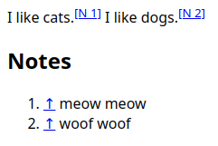
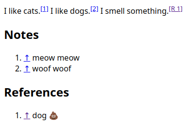
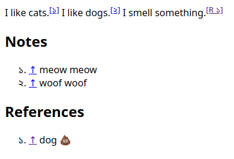
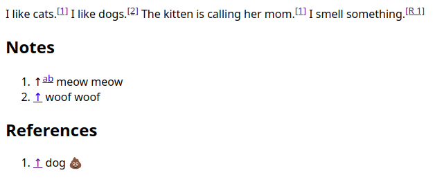
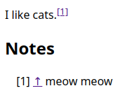

[](https://www.jsdelivr.com/package/npm/padatika)

# 📝 Padatika

Got frustrated with managing footnotes manually? Padatika can help.

For better viewing, [read this doc from Github](https://github.com/ashutoshbw/padatika/blob/v0.1.0/README.md).

## 🦄 Features

- ✨ Sorts footnotes automatically.
- 🔢 No need to manually number your references.
- 📂 You can easily organize your footnotes into different categories.
- ⤴️ Wikipedia-like backlinks.
- 🌍 Localization.
- ♿ Accessibility.
- 🛠️ Super customizable with over a dozen options.

## 🚀 Getting started

Let's see an example to get familier with Padatika quickly.

First, load Padatika and initialize it like below:

```html
<script type="module">
  import padatika from 'https://cdn.jsdelivr.net/npm/padatika@0.1.0/dist/index.js';

  padatika({ notes: 'N' });
</script>
```

> [!TIP]
> Above `padatika` is a default export. So you can name it anything else if you wish. But here, I will stick to this name.

Now in the `<body>` of your HTML, paste the following:

```html
I like cats.<sup data-fnref>notes:cats</sup>

I like dogs.<sup data-fnref>notes:dogs</sup>

<h2 id="notes">Notes</h2>
<ul>
  <li>[cats] meow meow</li>
  <li>[dogs] woof woof</li>
</ul>
```

Now load the page in your browser with a local web server. You should see something like this:


Here, as you can see padatika automatically numbers for your footnotes. and add backlinks at the start of footnotes.

You've probably guessed how the linking is happening between footnotes and its references. Let's be clear about it and a few other things now so you can understand the rest of the doc easily:

- First, footnotes in padatika are organized by categories. A category is just a part of document starting with a heading element with an id containing the category name. In most case you will need just one or two categories, but you can have as many categories as you like in a similar fashion. You tell padatika to look for a category by passing its name as a key of a property of the object that you pass to `padatika`. We will see the role of the value of this property in a minute. First let's cover few other things.
- Below the category heading, you have to write your footnotes in `<li>` elements wrapped in an unordered list(`<ul>`). Padatika will convert it to an ordered list and sort your footnotes to match references order.
- Each footnote must start with a **name** wrapped with square brackets(`[]`) that is unique within the corresponding category. A name can be composed of a combination lowercase or uppercase English alphabets, numbers, dash(`-`) and underscore(`_`).
- To create a reference you have to use the following template: `<sup data-fnref>category_name:footnote_name</sup>`. For example, `<sup data-fnref>notes:cats</sup>` means, it links to a footnote of name `cats` under the `notes` category. Here `data-fnref` empty data attribute is used by padaika by default to collect the references for processing.
- Now let's talk about the `'N'` value given to the `notes` key in the object passed to `padatika` call. It's a footnote category indicator that you may want to see in your rendered references. In the example above it has no effect because by default Padatika doesn't show the category indicator for the first category that appears in the document. However it will appear if there is another category that comes before the "notes" category. You can also set the option `ignoreIndicatorOfFirstCategory` to `false` to make sure all category indicators appear. Options are set by passing another object to `padatika`. So the call to `padatika` in this case will look like below:

  ```js
  padatika({ notes: 'N' }, { ignoreIndicatorOfFirstCategory: false });
  ```

  Result:

  

## 🧩 Syntax of `padatika`

```js
padatika(categoryIdToCategoryIndicatorMap);
padatika(categoryIdToCategoryIndicatorMap, options);
```

### `categoryIdToCategoryIndicatorMap`(required)

We have already seen how this object looks like and an example with one category in the [Getting started](#-getting-started) section. If you haven't read that section, read it first. Assuming you have read it, here goes a little involved example:



<details>
  <summary>Can you guess the code? Click to reveal it.</summary>

```html
<script type="module">
  import padatika from 'https://cdn.jsdelivr.net/npm/padatika@0.1.0/dist/index.js';

  padatika({ notes: 'N', refs: 'R' });
</script>

I like cats.<sup data-fnref>notes:cats</sup>

I like dogs.<sup data-fnref>notes:dogs</sup>

I smell something.<sup data-fnref>refs:something</sup>

<h2 id="notes">Notes</h2>
<ul>
  <li>[cats] meow meow</li>
  <li>[dogs] woof woof</li>
</ul>

<h2 id="refs">References</h2>
<ul>
  <li>[something] dog 💩</li>
</ul>
```

</details>

### `options`(optional)

Here you can pass a optional object specifying options to configure padatika. The available options are:

- `numberFormat`
- `dataAttributePostfix`
- `enableBacklinks`
- `backlinkPos`
- `backlinkSymbol`
- `jumpTexts`
- `getBacklinkIdentifier`
- `getListStyleTypeStr`
- `ignoreIndicatorOfFirstCategory`
- `ignoreIndicatorOfCategory`
- `enableBrackets`
- `sep`
- `targetedBacklinkClassName`
- `backlinksWrapperClassName`

Head over to [All option](#%EF%B8%8F-all-options) section to read their purpose and possible values.

## 🛠️ All options

### `numberFormat`

Type: `string | ((n: number) => string)`

Default value: `latn`(i.e. [Latin digits](https://en.wikipedia.org/wiki/Arabic_numerals))

You can use this option to easily change the language/format of numbers in reference supscripts and footnotes.

For your convenience the following table describes all formats:

<details>
  <summary>Click to expand table</summary>

| Format   | Description                                                                |
| -------- | -------------------------------------------------------------------------- |
| adlm     | Adlam digits                                                               |
| ahom     | Ahom digits                                                                |
| arab     | Arabic-Indic digits                                                        |
| arabext  | Extended Arabic-Indic digits                                               |
| armn     | Armenian upper case numerals — algorithmic                                 |
| armnlow  | Armenian lower case numerals — algorithmic                                 |
| bali     | Balinese digits                                                            |
| beng     | Bengali digits                                                             |
| bhks     | Bhaiksuki digits                                                           |
| brah     | Brahmi digits                                                              |
| cakm     | Chakma digits                                                              |
| cham     | Cham digits                                                                |
| cyrl     | Cyrillic numerals — algorithmic                                            |
| deva     | Devanagari digits                                                          |
| diak     | Dives Akuru digits                                                         |
| ethi     | Ethiopic numerals — algorithmic                                            |
| finance  | Financial numerals — may be algorithmic                                    |
| fullwide | Full width digits                                                          |
| geor     | Georgian numerals — algorithmic                                            |
| gong     | Gunjala Gondi digits                                                       |
| gonm     | Masaram Gondi digits                                                       |
| grek     | Greek upper case numerals — algorithmic                                    |
| greklow  | Greek lower case numerals — algorithmic                                    |
| gujr     | Gujarati digits                                                            |
| guru     | Gurmukhi digits                                                            |
| hanidays | Han-character day-of-month numbering for lunar/other traditional calendars |
| hanidec  | Positional decimal system using Chinese number ideographs as digits        |
| hans     | Simplified Chinese numerals — algorithmic                                  |
| hansfin  | Simplified Chinese financial numerals — algorithmic                        |
| hant     | Traditional Chinese numerals — algorithmic                                 |
| hantfin  | Traditional Chinese financial numerals — algorithmic                       |
| hebr     | Hebrew numerals — algorithmic                                              |
| hmng     | Pahawh Hmong digits                                                        |
| hmnp     | Nyiakeng Puachue Hmong digits                                              |
| java     | Javanese digits                                                            |
| jpan     | Japanese numerals — algorithmic                                            |
| jpanfin  | Japanese financial numerals — algorithmic                                  |
| jpanyear | Japanese first-year Gannen numbering for Japanese calendar                 |
| kali     | Kayah Li digits                                                            |
| kawi     | Kawi digits                                                                |
| khmr     | Khmer digits                                                               |
| knda     | Kannada digits                                                             |
| lana     | Tai Tham Hora (secular) digits                                             |
| lanatham | Tai Tham Tham (ecclesiastical) digits                                      |
| laoo     | Lao digits                                                                 |
| latn     | Latin digits                                                               |
| lepc     | Lepcha digits                                                              |
| limb     | Limbu digits                                                               |
| mathbold | Mathematical bold digits                                                   |
| mathdbl  | Mathematical double-struck digits                                          |
| mathmono | Mathematical monospace digits                                              |
| mathsanb | Mathematical sans-serif bold digits                                        |
| mathsans | Mathematical sans-serif digits                                             |
| mlym     | Malayalam digits                                                           |
| modi     | Modi digits                                                                |
| mong     | Mongolian digits                                                           |
| mroo     | Mro digits                                                                 |
| mtei     | Meetei Mayek digits                                                        |
| mymr     | Myanmar digits                                                             |
| mymrshan | Myanmar Shan digits                                                        |
| mymrtlng | Myanmar Tai Laing digits                                                   |
| nagm     | Nag Mundari digits                                                         |
| native   | Native digits                                                              |
| newa     | Newa digits                                                                |
| nkoo     | N'Ko digits                                                                |
| olck     | Ol Chiki digits                                                            |
| orya     | Oriya digits                                                               |
| osma     | Osmanya digits                                                             |
| rohg     | Hanifi Rohingya digits                                                     |
| roman    | Roman upper case numerals — algorithmic                                    |
| romanlow | Roman lowercase numerals — algorithmic                                     |
| saur     | Saurashtra digits                                                          |
| segment  | Legacy computing segmented digits                                          |
| shrd     | Sharada digits                                                             |
| sind     | Khudawadi digits                                                           |
| sinh     | Sinhala Lith digits                                                        |
| sora     | Sora_Sompeng digits                                                        |
| sund     | Sundanese digits                                                           |
| takr     | Takri digits                                                               |
| talu     | New Tai Lue digits                                                         |
| taml     | Tamil numerals — algorithmic                                               |
| tamldec  | Modern Tamil decimal digits                                                |
| tnsa     | Tangsa digits                                                              |
| telu     | Telugu digits                                                              |
| thai     | Thai digits                                                                |
| tirh     | Tirhuta digits                                                             |
| tibt     | Tibetan digits                                                             |
| traditio | Traditional numerals — may be algorithmic                                  |
| vaii     | Vai digits                                                                 |
| wara     | Warang Citi digits                                                         |
| wcho     | Wancho digits                                                              |

</details>

See the [Unicode CLDR Project's `numbers.xml`](https://github.com/unicode-org/cldr/blob/main/common/bcp47/number.xml) file for up to date list of them.

If some of the these format doesn't have implementation or you need to format/translate it in a different way, you can also pass a function to this option. This function takes in a javascript number and and should return a string of the formatted/translated number of your desired way.

If you want to format the numbers in Bengali, here is an example:

<details>
  <summary>Click to see the example</summary>



Code:

```html
<script type="module">
  import padatika from 'https://cdn.jsdelivr.net/npm/padatika@0.1.0/dist/index.js';

  padatika({ notes: 'N', refs: 'R' }, { numberFormat: 'beng' });
</script>

I like cats.<sup data-fnref>notes:cats</sup>

I like dogs.<sup data-fnref>notes:dogs</sup>

I smell something.<sup data-fnref>refs:something</sup>

<h2 id="notes">Notes</h2>
<ul>
  <li>[cats] meow meow</li>
  <li>[dogs] woof woof</li>
</ul>

<h2 id="refs">References</h2>
<ul>
  <li>[something] dog 💩</li>
</ul>
```

</details>

### `dataAttributePostfix`

Type: `string`

Default value: `fnref`

By default Padatika looks for elements having the `data-fnref` data attribute to detect them as references to footnotes. This options allow you to choose a different data attribute for this purpose. For example if want `data-ref` instead of `data-fnref`, you could pass just the postfix part, that is, `'ref'` to this option.

> [!CAUTION]
> Since you might have a lot of markdown/HTML files depended on this, changing this value would also require you to change the data attribute on each of these files. So it's better to stick with some specific value of this option from the start.

### `enableBacklinks`

Type: `boolean`

Default value: `true`

This option allows you to turn on/off backlinks in the footnotes.

### `backlinkPos`

Type: `'start' | 'end'`

Default value: `start`

It controls where the backlinks are displayed — to the `'start'` or `'end'` of the footnotes.

### `backlinkSymbol`

Type: `string`

Default value: `↑`

It is the symbol that you will see at the start of the backlinks part of each footnote.

> [!NOTE]
> If you have just one reference to a footnote, then this symbol is a link that points to that reference. If you have multiple reference to a footnote then initially this symbol is just text but when you click on any of its references, this symbol will turn into a link pointing back to that specific reference that you clicked.

### `jumpTexts`

Type:

```
{
  jumpUp?: string;
  jumpBackUp?: string;
  jumpUpTo?: string;
}
```

Default value:

```js
{
  jumpUp: 'Jump up',
  jumpBackUp: 'Jump back up',
  jumpUpTo: 'Jump up to: ',
}
```

The `jumpUp` and `jumpBackUp` property values are used for showing tooltip text and `aria-label`(useful for screen reader users) for the backlink symbol.

The `jumpUpTo` is solely for screen reader users to give them some context to the backlink superscripts(which appear if you have multiple references to this footnote) that holds backlinks next to the backlink symbol.

You might want to translate the English text values for these properties if your content is in a different language.

### `getBacklinkIdentifier`

Type: `(n: number) => string`

Default Behavior: It uses [`numberFormat`](#numberformat) option to determine the format of the each individual backlink superscripts which exist next to [backlink symbol](#backlinksymbol).

Here `n` is a natural number. `1`, `2` and so on relates to the first, second and so on backlink superscripts. The returned string is placed in the corresponding position.

Following is an example that uses English alphabets instead of numbers for backlink superscripts.

<details>
<summary>Click to see the example</summary>



Code:

```html
<script type="module">
  import padatika from 'https://cdn.jsdelivr.net/npm/padatika@0.1.0/dist/index.js';

  padatika(
    { notes: 'N', refs: 'R' },
    {
      getBacklinkIdentifier: (n) => {
        return 'abcdefghijklmnopqrstuvwxyz'[n - 1];
      },
    },
  );
</script>
I like cats.<sup data-fnref>notes:cats</sup>

I like dogs.<sup data-fnref>notes:dogs</sup>

The kitten is calling her mom.<sup data-fnref>notes:cats</sup>

I smell something.<sup data-fnref>refs:something</sup>

<h2 id="notes">Notes</h2>
<ul>
  <li>[cats] meow meow</li>
  <li>[dogs] woof woof</li>
</ul>

<h2 id="refs">References</h2>
<ul>
  <li>[something] dog 💩</li>
</ul>
```

</details>

### `getListStyleTypeStr`

Type: `(formattedNum: string) => string`

Default value: ``(formattedNum: string) => `${formattedNum}. ` ``

This option is used for determininig the footnotes numbering format. The function takes in the formatted number(which depends on the [`numberFormat`](#numberformat) option) and should return a string based on it.

<details>
<summary>Click to see an example</summary>



Code:

```html
<script type="module">
  import padatika from 'https://cdn.jsdelivr.net/npm/padatika@0.1.0/dist/index.js';

  padatika(
    { notes: 'N', refs: 'R' },
    {
      getListStyleTypeStr: (formattedNum) => `[${formattedNum}]`,
    },
  );
</script>

I like cats.<sup data-fnref>notes:cats</sup>

<h2 id="notes">Notes</h2>
<ul>
  <li>[cats] meow meow</li>
</ul>
```

</details>

## 🙏 Acknowledgement

I stole the design of footnote backlinks from Wikipedia.
